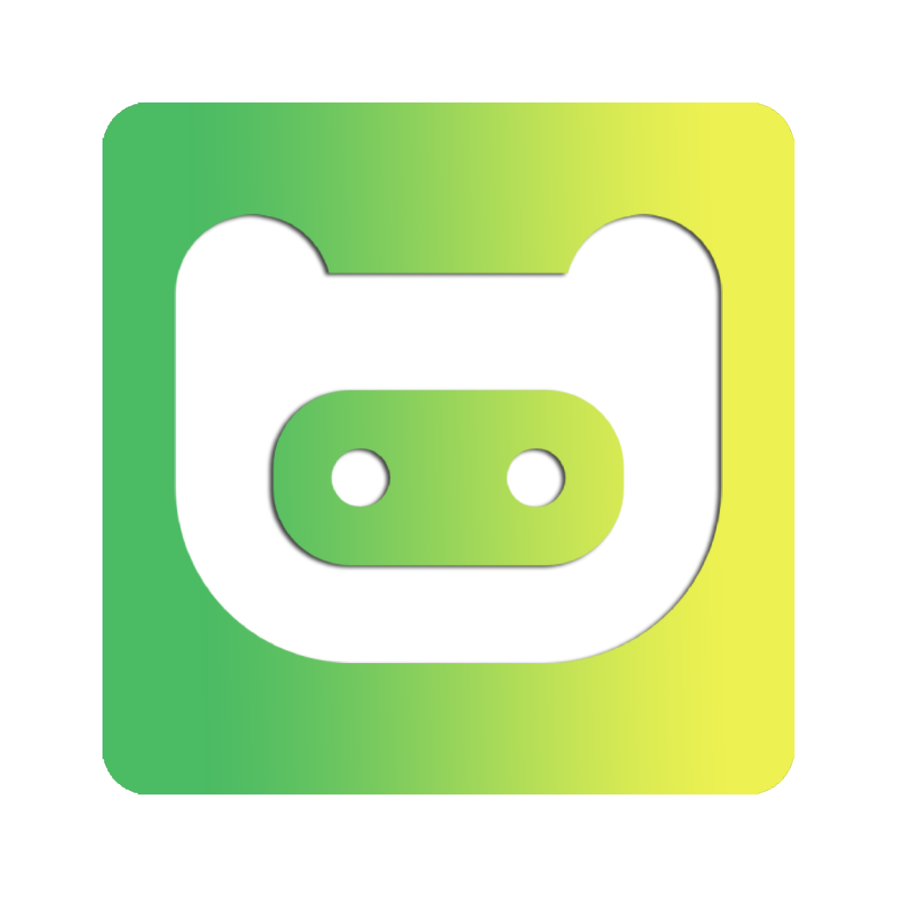

<div align="center">
  
  <h1>MiniMe</h1>
  <p>A lightweight macOS menu bar utility that captures text from anywhere on your screen, retypes it into any app, and keeps a full searchable history - powered by Apple's Vision framework with no external dependencies.</p>

  <p>This was made for my personal use, and made public in case somebody else finds those deature useful<p>
</div>


https://github.com/user-attachments/assets/1ce8e2f5-3c4f-4365-a2ab-2ad58d200ddc

## Features

### OCR & Capture
- **Quick Screen Capture** - Select any area on screen with a drag gesture and crosshair cursor
- **Instant OCR** - Text extraction powered by Apple's Vision framework
- **Multi-Display Support** - Works seamlessly across multiple monitors with Retina scaling
- **Auto-Copy to Clipboard** - Extracted text is automatically copied for immediate use
- **Multi-Language OCR** - Supports 11 languages: English (US/UK), German, French, Spanish, Italian, Portuguese, Chinese (Simplified/Traditional), Japanese, Korean
- **OCR Accuracy Modes** - Choose between fast and accurate recognition
- **Line-Aware Text Ordering** - Intelligent ordering that respects document layout

### Type It
- **Retype Anywhere** - Captures selected text and replays it keystroke-by-keystroke into any app, bypassing paste restrictions
- **Countdown Timer** - Configurable 1–10 second countdown before typing starts, giving you time to switch windows
- **Countdown Sound** - Optional audio tick each second of the countdown
- **Custom Shortcut** - Dedicated global hotkey for Type It

### History
- **Capture History** - Searchable history of the last 100 captures
- **Source App Tracking** - Each capture records which application was active, shown with the app's icon
- **Quick Access** - Open history from the menu bar or a global hotkey

### System
- **Prevent Sleep** - Keep your Mac awake for a set duration: 10 min, 30 min, 1 hr, 2 hrs, 4 hrs, 8 hrs, or indefinitely. Disable any time from the menu bar
- **Auto-Update Check** - Silently checks for new GitHub releases once per day; shows a notification in Settings → About when an update is available
- **Launch at Login** - Optional startup on system boot
- **Customizable Shortcuts** - Configure global hotkeys for capture, history, and Type It
- **Native macOS Experience** - Built with SwiftUI and AppKit, no external dependencies

## Screenshots


## Requirements

| Requirement | Minimum |
|-------------|---------|
| **macOS** | 13.0 (Ventura) or later |
| **Permissions** | Screen Recording, Accessibility |
| **Architecture** | Apple Silicon & Intel |

## Installation

### Download

Download the latest release from the [Releases](../../releases) page.

### Build from Source

```bash
# Clone the repository
git clone https://github.com/marduc812/kimeno.git
cd kimeno

# Build release version
xcodebuild -project MiniMe.xcodeproj -scheme MiniMe -configuration Release
```

## Usage

1. Launch MiniMe - the app appears in your menu bar
2. **Capture Text** - Press the capture shortcut (default: `⌘⇧2`) or click "Capture" from the menu
3. **Select Area** - Click and drag to select the screen region containing text
4. **Done** - Text is extracted and copied to your clipboard automatically

### Type It

1. Select text in any application
2. Press the Type It shortcut (default: `⌘⇧1`)
3. Switch to your target window during the countdown
4. MiniMe retypes the text character by character

### Prevent Sleep

Click **Prevent Sleep** in the menu bar and choose a duration. A "Turn Off Prevent Sleep" button appears in the menu while active. The assertion is released automatically when the duration ends or the app quits.

### Default Keyboard Shortcuts

| Action | Shortcut |
|--------|----------|
| Capture | `⌘⇧2` |
| Type It | `⌘⇧1` |
| History | `⌘⇧H` |
| Settings | `⌘,` |
| Quit | `⌘Q` |

Shortcuts can be fully customized in Settings → Shortcuts.

## Settings

### General
- Launch at login
- Show/hide menu bar icon
- Prevent sleep (with duration)

### Capture (Image to Text)
- Auto-copy to clipboard
- Play sound on capture
- Recognition language
- OCR accuracy (fast / accurate)
- Line-aware text ordering

### Type It
- Countdown duration (1–10 seconds)
- Sound on countdown

### Shortcuts
- Customize global hotkeys for Capture, History, and Type It

### About
- Current version
- Check for updates (compares against latest GitHub release)
- Link to GitHub repository

## Permissions

| Permission | Purpose |
|------------|---------|
| **Screen Recording** | Capture screen content for OCR |
| **Accessibility** | Detect global keyboard shortcuts and simulate typing |

On first launch, macOS will prompt you to grant these permissions. You can also enable them manually:

1. **System Settings → Privacy & Security → Screen Recording** → enable MiniMe
2. **System Settings → Privacy & Security → Accessibility** → enable MiniMe

## Project Structure

```
MiniMe/
├── App/                    # App entry point & menu bar
├── Managers/               # State & business logic
│   ├── SettingsManager.swift
│   ├── HotkeyManager.swift
│   ├── CaptureHistoryStore.swift
│   ├── TextPreviewManager.swift
│   └── UpdateManager.swift
├── Services/               # Workers
│   ├── ScreenCaptureManager.swift
│   └── TypingService.swift
├── Models/                 # Data models
├── Selection/              # Full-screen selection overlay
├── Settings/               # Settings UI (tabbed)
├── History/                # History panel
├── Onboarding/             # First-launch permission flow
├── UI/                     # Shared UI components
└── Extensions/             # Swift extensions
```

## Running Tests

```bash
# Unit tests
xcodebuild -project MiniMe.xcodeproj -scheme MiniMe test

# UI tests
xcodebuild -project MiniMe.xcodeproj -scheme MiniMe -destination 'platform=macOS' test
```
