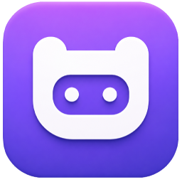

<div align="center">
  
  <h1>MiniMe</h1>
  <p>A lightweight macOS menu bar utility that captures text from anywhere on your screen, retypes it into any app, and keeps a full searchable history - powered by Apple's Vision framework with no external dependencies.</p>

  <p>This was made for my personal use, and made public in case somebody else finds those deature useful<p>
</div>

## Features

### OCR & Capture
- **Quick Screen Capture** - Select any area on screen with a drag gesture and crosshair cursor
- **Instant OCR** - Text extraction powered by Apple's Vision framework, using the newest recognition revision available on your Mac
- **Small-Text Upscaling** - Tight selections of small text are automatically upscaled before recognition, dramatically improving accuracy on the cases Vision would otherwise miss
- **Automatic Language Detection** - Recognizes text even when it isn't in your selected language
- **Multi-Display Support** - Works seamlessly across multiple monitors with Retina scaling
- **Auto-Copy to Clipboard** - Extracted text is automatically copied for immediate use
- **Multi-Language OCR** - Supports 11 languages: English (US/UK), German, French, Spanish, Italian, Portuguese, Chinese (Simplified/Traditional), Japanese, Korean
- **OCR Accuracy Modes** - Choose between fast and accurate recognition
- **Line-Aware Text Ordering** - Intelligent ordering that respects document layout
- **Language Correction Toggle** - Optional natural-language correction (off by default, since it can alter code, URLs, and IDs)

### Type It
- **Retype Anywhere** - Captures selected text and replays it keystroke-by-keystroke into any app, bypassing paste restrictions
- **Countdown Timer** - Configurable 1–10 second countdown before typing starts, giving you time to switch windows
- **Countdown Sound** - Optional audio tick each second of the countdown
- **Custom Shortcut** - Dedicated global hotkey for Type It

### Clipboard Manager
- **Automatic Clipboard History** - Every copy on your Mac (text, images, files) is saved automatically, including OCR captures - no separate history to manage
- **Quick Picker** - Searchable popover opened with a global hotkey; navigate with arrow keys and paste any of the top 9 items with `⌘1`–`⌘9`
- **Source App Tracking** - Each entry records which app it was copied from, shown with the app's icon
- **Copy or Copy & Paste** - Choose whether picking an item just copies it or also pastes it straight into the app you came from
- **Images & Files** - Optionally capture images and file references from the clipboard, not just text
- **Password Manager Aware** - Entries marked "concealed" by apps like password managers are never stored
- **Configurable History Limit** - Keep 50, 100, 200, or 500 items
- **Clear History** - Wipe all clipboard history in one click

### Scheduled Actions
- **Delayed Typing** - Schedule MiniMe to type text and/or press a key combo after a set delay (seconds, minutes, or hours)
- **Repeat** - Optionally repeat the action on the same interval instead of firing once
- **Runs in the Background** - Fires into whichever window is focused when the timer elapses; pair with Prevent Sleep for long delays

### Move Mouse
- **Keep Sessions Awake** - Periodically drifts the cursor to random points in a 600×600 area to prevent idle timeouts and screen locks
- **Configurable Interval** - Set the minimum and maximum seconds between moves
- **Natural Movement** - Smooth, eased glides rather than instant jumps, so it registers as real activity

### System
- **Prevent Sleep** - Keep your Mac awake for a set duration: 10 min, 30 min, 1 hr, 2 hrs, 4 hrs, 8 hrs, or indefinitely. Disable any time from the menu bar
- **Per-Tool On/Off Switches** - Turn Capture, Type It, Clipboard, Move Mouse, and Prevent Sleep on or off individually; disabled tools disappear from the menu bar and lose their hotkey
- **Auto-Update Check** - Silently checks for new GitHub releases once per day; shows a notification in Settings → About when an update is available
- **Launch at Login** - Optional startup on system boot
- **Customizable Shortcuts** - Configure global hotkeys for every tool
- **Native macOS Experience** - Built with SwiftUI and AppKit, no external dependencies


## Requirements

| Requirement | Minimum |
|-------------|---------|
| **macOS** | 13.0 (Ventura) or later |
| **Permissions** | Screen Recording, Accessibility |
| **Architecture** | Apple Silicon & Intel |

## Installation

### Download

Download the latest release from the [Releases](../../releases) page.

### Build from Source

```bash
# Clone the repository
git clone https://github.com/marduc812/kimeno.git
cd kimeno

# Build release version
xcodebuild -project MiniMe.xcodeproj -scheme MiniMe -configuration Release
```

## Usage

1. Launch MiniMe - the app appears in your menu bar
2. **Capture Text** - Press the capture shortcut (default: `⌘⇧2`) or click "Capture" from the menu
3. **Select Area** - Click and drag to select the screen region containing text
4. **Done** - Text is extracted and copied to your clipboard automatically

### Type It

1. Select text in any application
2. Press the Type It shortcut (default: `⌘⇧1`)
3. Switch to your target window during the countdown
4. MiniMe retypes the text character by character

### Prevent Sleep

Click **Prevent Sleep** in the menu bar and choose a duration. A "Turn Off Prevent Sleep" button appears in the menu while active. The assertion is released automatically when the duration ends or the app quits.

### Default Keyboard Shortcuts

| Action | Shortcut |
|--------|----------|
| Capture | `⌘⇧2` |
| Type It | `⌘⇧1` |
| Clipboard picker | `⌥C` |
| Start / Stop Move Mouse | `⌘⇧M` |
| Settings | `⌘,` |
| Quit | `⌘Q` |

Shortcuts can be fully customized in Settings → Shortcuts.

## Settings

### General
- Launch at login
- Show/hide menu bar icon
- Per-tool on/off switches (Capture, Type It, Clipboard, Move Mouse, Prevent Sleep)

### Capture (Image to Text)
- Play sound on capture
- Recognition language
- OCR accuracy (fast / accurate)
- Line-aware text ordering
- Language correction (off by default)

### Type It
- Countdown duration (1–10 seconds)
- Sound on countdown

### Scheduler
- Delay before firing (seconds / minutes / hours)
- Repeat on the same interval
- Text to type and/or a key combo to press

### Move Mouse
- Minimum and maximum seconds between moves

### Clipboard
- History limit (50 / 100 / 200 / 500 items)
- Copy-only vs. copy & paste on selection
- Capture images and files
- Ignore password-manager (concealed) clipboard content

### Shortcuts
- Customize global hotkeys for Capture, Type It, Clipboard, and Move Mouse

### About
- Current version
- Check for updates (compares against latest GitHub release)
- Link to GitHub repository

## Permissions

| Permission | Purpose |
|------------|---------|
| **Screen Recording** | Capture screen content for OCR |
| **Accessibility** | Detect global keyboard shortcuts and simulate typing |

On first launch, macOS will prompt you to grant these permissions. You can also enable them manually:

1. **System Settings → Privacy & Security → Screen Recording** → enable MiniMe
2. **System Settings → Privacy & Security → Accessibility** → enable MiniMe

## Project Structure

```
MiniMe/
├── App/                    # App entry point & menu bar
├── Managers/               # State & business logic
│   ├── SettingsManager.swift
│   ├── HotkeyManager.swift
│   ├── CaptureHistoryStore.swift
│   ├── TextPreviewManager.swift
│   └── UpdateManager.swift
├── Services/               # Workers
│   ├── ScreenCaptureManager.swift
│   ├── OCREngine.swift          # Vision text recognition (testable, standalone)
│   ├── OCRImageProcessor.swift  # Pre-OCR upscaling for small text
│   └── TypingService.swift
├── Models/                 # Data models
├── Selection/              # Full-screen selection overlay
├── Settings/               # Settings UI (tabbed)
├── History/                # History panel
├── Onboarding/             # First-launch permission flow
├── UI/                     # Shared UI components
└── Extensions/             # Swift extensions
```

## Running Tests

```bash
# Unit tests
xcodebuild -project MiniMe.xcodeproj -scheme MiniMe test

# UI tests
xcodebuild -project MiniMe.xcodeproj -scheme MiniMe -destination 'platform=macOS' test
```

### OCR regression corpus

OCR quality is guarded by a fixture-based test that runs the engine against real images
and asserts on the recovered text. To grow coverage, drop a PNG into
`MiniMeTests/Fixtures/` and add an entry to `MiniMeTests/Fixtures/ocr-fixtures.json`:

```json
{
  "fixtures": [
    { "image": "my_screenshot.png", "mustContain": ["expected", "text"] }
  ]
}
```

Every fixture is checked on each test run, so accuracy improvements are protected against
regressions over time.
